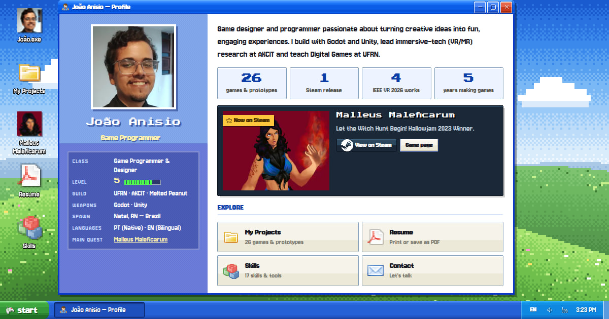

# João Anisio — Portfólio · **JoãoOS XP**

> Um desktop **Windows XP em pixel-art** que funciona como portfólio: projetos, pesquisa,
> experiência, currículo e contato — tudo em HTML, CSS e JavaScript puros, **sem frameworks,
> sem build obrigatório e sem nenhuma requisição de terceiros**.

**Ao vivo:** <https://caduceusj.github.io/> · *Live site:* open it and click around — double-click is optional.



## O que tem dentro

| App (ícone no desktop) | O que faz |
|---|---|
| **João.exe** | Perfil com "ficha de personagem" (classe, nível = anos de carreira, guilda, armas), estatísticas animadas, destaque do jogo na Steam e atalhos |
| **Meus Projetos** | Explorer estilo XP: pastas/coleções, busca, ordenação, 3 modos de exibição (miniaturas, lista, detalhes), painel de detalhes e visualizador com galeria de imagens |
| **Malleus Maleficarum** | Página no estilo Steam do jogo em destaque |
| **Currículo** | CV bilíngue pronto para **imprimir / salvar em PDF** (layout próprio de impressão) |
| **Habilidades** | 17 skills em "tiles" coloridos, ligadas aos projetos (ex.: Godot → 21 projetos) |
| **Experiência · Educação e Pesquisa · Conquistas** | Linha do tempo com filtros, artigos IEEE VR 2026 e lista de conquistas estilo Steam |
| **Contato** | Compositor de e-mail (`mailto:`), assuntos prontos, copiar endereço e **salvar contato (.vcf)** |
| **LinkedIn · about_me.txt · Terminal** | Perfil, bloco de notas funcional (salvar/imprimir) e um terminal com `help`, `neofetch`, `open malleus`, `projects godot`, `lang pt`, `theme olive`… |
| **Propriedades de Exibição** | 3 temas (Azul, Verde Oliva, Prata), papéis de parede pixel-art procedurais (dia/pôr do sol/noite, automático pela hora do dia), idioma, sons e animações |

Também: boot + tela de login do XP, menu Iniciar de duas colunas, bandeja (PT/EN, som, relógio),
balões de notificação, menus de contexto, janelas que arrastam / redimensionam / maximizam / minimizam,
**links diretos** (`/#project/malleusgame`, `/#resume`, `/#contact`…), site **bilíngue PT/EN** com
detecção automática, e easter eggs (código Konami, `sudo hire joao` 😉).

## Rodando localmente

```bash
# qualquer servidor estático serve; o site não precisa de build
npx http-server -p 8080 -c-1 .     # ou: npm run serve
```

Abrir o `index.html` direto do disco (`file://`) também funciona.

## Como editar o conteúdo

Tudo que é texto do portfólio está em **`js/data.js`** (um objeto `{ pt, en }` por campo):

```js
// js/data.js → projects
{ id: 'meujogo', title: 'Meu Jogo', eng: ['Godot'], kind: 'game', featured: true,
  desc: L('Descrição curta em PT', 'Short description in EN'),
  url: 'https://caduceusj.itch.io/meu-jogo',            // opcional
  role: L('Programador', 'Programmer'),                   // opcional
  award: L('Finalista da Game Jam X', 'Game Jam X Finalist'), // opcional
  tags: ['Roguelike'] }
```

* **Capa do projeto:** coloque a imagem em `assets/` e inclua uma linha em `tools/images.config.mjs`;
  depois rode `npm i && npm run build:images` — ele gera WebP otimizado (miniatura, versão grande e
  galeria) e atualiza `js/media-manifest.js`. Sem rodar nada, também dá para usar `img: 'assets/capa.png'`
  direto no `data.js`. Projetos sem imagem ganham uma capa pixel-art gerada automaticamente.
* **Textos da interface:** `js/strings.js`. **Experiência, formação, pesquisa, conquistas, skills:** `js/data.js`.
* **Ícones:** `tools/icons.config.mjs` é o catálogo; `npm run build:icons` empacota **somente os usados no código**
  (sprite PNG + SVG inline em `index.html`).
* **Privacidade:** `npm run strip-exif` remove metadados (GPS, modelo do celular) de JPEGs — já aplicado em `assets/Eu.jpg`.

## Estrutura

```
index.html            casca, SEO (Open Graph, JSON-LD), fallback <noscript>, sprite de ícones inline
404.html              tela azul (BSOD) bilíngue
css/                  base (tokens/temas/janelas) · shell (desktop, iniciar, taskbar) · apps · icons (gerado)
js/                   data · strings · core · wm (janelas) · wallpaper · shell · apps-* · main
assets/fonts          Jersey 10 (UI), VT323 (terminal), Press Start 2P (destaques) — woff2 latin, 44 KB
assets/icons          sprite Silk (gerado) + LICENSES.md
assets/img            WebP otimizado (gerado) + retratos pixelados
tools/                scripts de build de assets (opcionais) e os ícones-fonte vendorizados
```

## Otimização (medido com Lighthouse local + Playwright)

* **Lighthouse (desktop): Performance 100 · Acessibilidade 100 · Boas práticas 100 · SEO 100** — FCP 0,4 s, LCP 0,7 s, TBT 0 ms, CLS 0.
* Primeira carga ≈ **320 KB sem compressão (≈ 135 KB com gzip)**, 26 requisições, **zero terceiros**
  (antes: Font Awesome + XP.css via CDN e uma foto de 1,6 MB usada como avatar de 40 px).
* Imagens: **10,4 MB → 1 MB** em WebP; as capas só carregam quando aparecem (`loading="lazy"`).
* Fontes pixel auto-hospedadas (3 famílias, subset latino) com `preload` e `font-display: swap`.
* Acessibilidade: axe-core sem violações, navegação por teclado, `prefers-reduced-motion`, zoom liberado.

## Créditos e licenças

* Ícones: [Silk](https://famfamfam.com/lab/icons/silk/) — Mark James (CC BY 2.5) ·
  [pixelarticons](https://github.com/halfmage/pixelarticons) — Gerrit Halfmann (MIT) ·
  [Simple Icons](https://simpleicons.org) (CC0). Detalhes em [`assets/icons/LICENSES.md`](assets/icons/LICENSES.md).
* Fontes (SIL OFL 1.1): Jersey 10, VT323, Press Start 2P — [`assets/fonts/LICENSE-OFL.txt`](assets/fonts/LICENSE-OFL.txt).
* *Windows XP é marca registrada da Microsoft Corporation. O JoãoOS XP é uma homenagem independente feita por fã e
  não é afiliado nem endossado pela Microsoft.*

---

### English in one paragraph

JoãoOS XP is my portfolio rendered as a pixel-art Windows XP desktop: profile card with an RPG-style character
sheet, a projects explorer with galleries, a Steam-style page for *Malleus Maleficarum*, a printable bilingual
resume, a contact composer (with vCard download), terminal, themes and procedural wallpapers. It is plain
HTML/CSS/JS with no build step and no third-party requests; assets are pre-optimized (WebP, pixel fonts, a trimmed
icon sprite) and the site scores 100/100/100/100 on Lighthouse. Content lives in `js/data.js` (bilingual `{pt, en}` fields).
